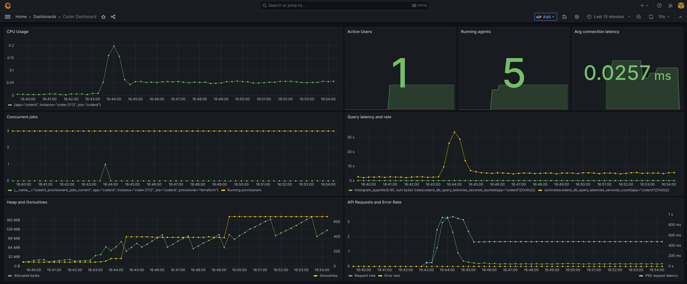
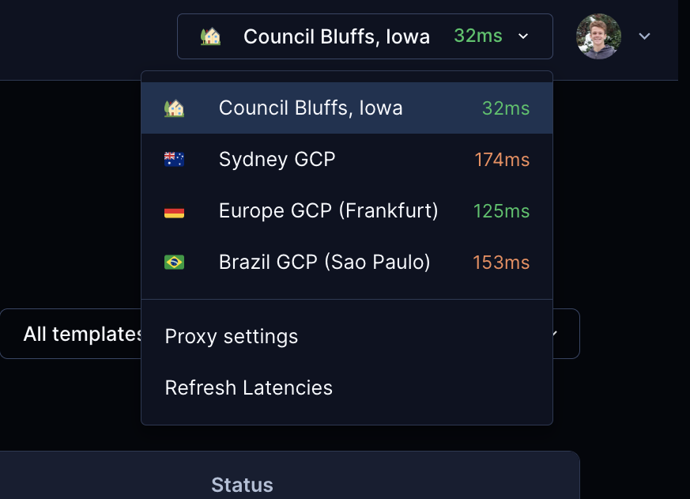
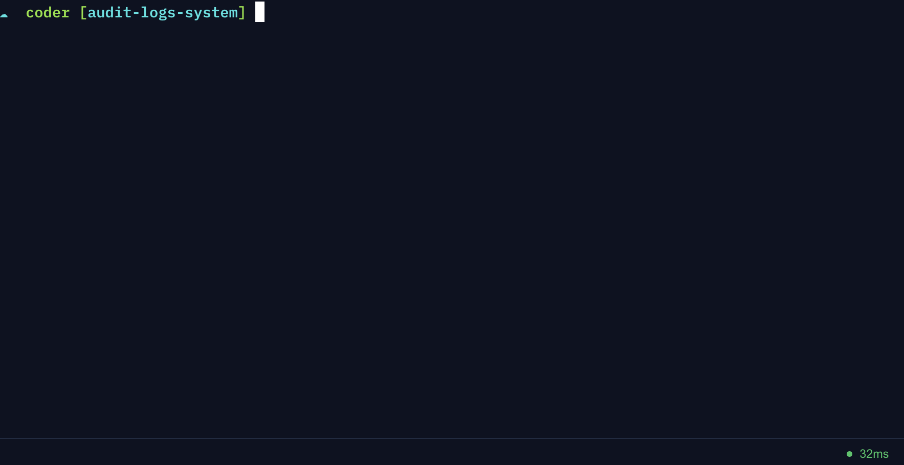

This month's new features give admins better insight into their Coder instance and give developers support for Developer Containers and OpenStack.

## Grafana Dashboard

[Scaling](https://coder.com/docs/v2/latest/admin/scale) Coder is easier to monitor with support for [Grafana](https://grafana.com/). Coder can already generate [Prometheus metrics](https://coder.com/docs/v2/latest/admin/prometheus). Now you can keep an eye on these metrics in a Grafana dashboard.

## Agent Metadata

Developers can see realtime CPU usage, disk usage, or almost any other information about a running workspace with [agent metadata](https://coder.com/docs/v2/latest/templates/agent-metadata).

You define metadata in a template as `metadata` arguments in the `resource "coder_agent" "main"` block. This metadata appears in the Coder web page of the running workspace.

You can get CPU and memory usage information for the workspace with the `coder stat` command. This command gives more accurate usage info than `top` and `free`, which show usage for the host machine, not the container.

## Workspace Proxies

You can reduce network latency for geographically distributed teams with [workspace proxies](https://coder.com/docs/v2/latest/admin/workspace-proxies). A workspace proxy relays the connection between your Coder instance and a remote developer.

Coder's makes the best effort to connect directly to a workspace. In situations when this isn't possible, like developing with a [web IDE or the web terminal](https://coder.com/docs/v2/latest/ides/web-ides), workspace proxies can reduce latency.

Setting up a workspace proxy is easy: just 2 commands let you support developers in other time zones.

Developers can choose the fastest workspace proxy for them.

Coder also shows latency times at the bottom of the workspace and web terminal pages.

## Developer Containers

You can bring your own VS Code [Developer Containers](https://containers.dev/) to Coder. Let your developers focus on their dependencies while your platform teams work on infrastructure.

Coder supports Dev Containers out of the box. You only need to provide a URL and Coder does the rest: a workspace builds then starts a container for your development environment.

To support this feature, Coder started [envbuilder](https://github.com/coder/envbuilder), an open source project that rebuilds its own container from a `devcontainer.json` file.

## OpenStack

You can support your developers who work from [OpenStack](https://www.openstack.org/). Coder has a starter template for provisioning workspaces from your OpenStack installation.
