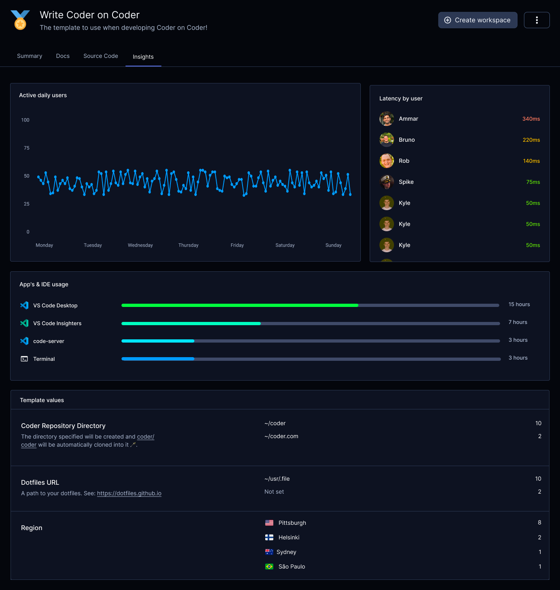
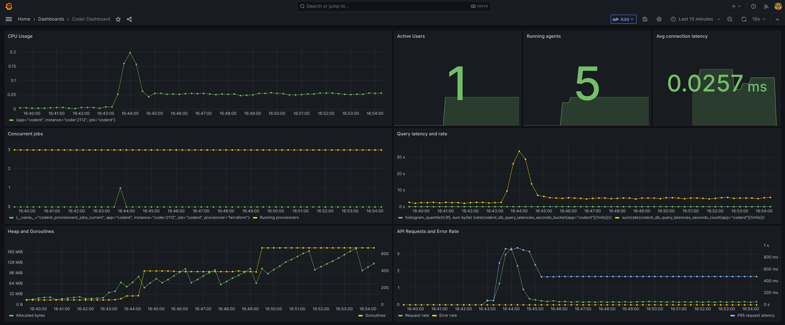
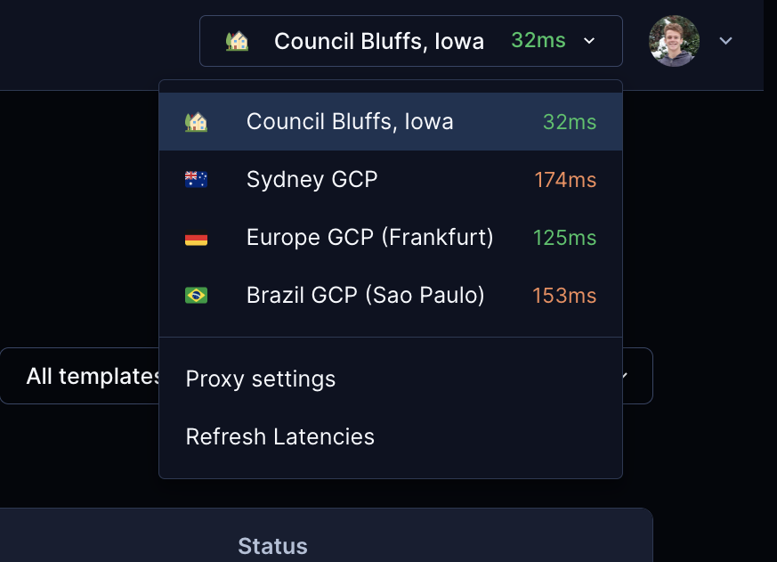
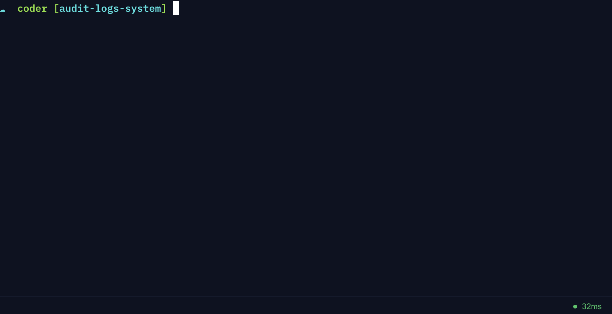
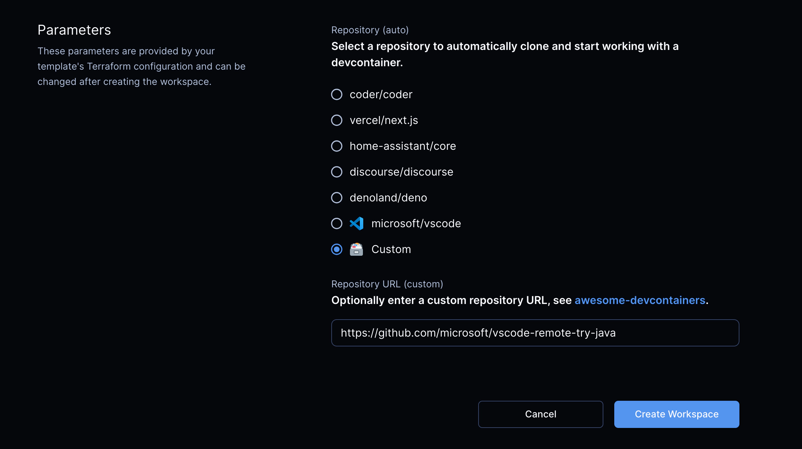

We're excited to share this month's new features. They give admins better insights into their Coder instance and new tools to act on them. And we've given developers more options for working with VS Code Devcontainers and JetBrains IDEs.

For more details on the features below, see our improved [Changelog](https://github.com/coder/coder/releases).

## Insights

You can get useful details about how your organization uses Coder with **Insights**. **Insights** lets you make better decisions to support your Coder users and efficiently use your IT infrastructure.

**Insights** shows daily usage, latency per user and region, and other information. Use it to do things like find high latency for geographically remote users, when users are most active, confirm changes to a template, and identify popular or unused templates.

## Other New Features

### Grafana Dashboard

Coder can already generate [Prometheus metrics](https://coder.com/docs/v2/latest/admin/prometheus). We've added a sample Grafana dashboard that you can import. It has important metrics for keeping an eye on [scaling](https://coder.com/docs/v2/latest/admin/scale) Coder and measuring adoption.

### Agent Metadata

Developers can see realtime CPU usage, disk usage, or almost any other information about a running workspace with [agent metadata](https://coder.com/docs/v2/latest/templates/agent-metadata).

In a template, you define metadata as `metadata` arguments in the `resource "coder_agent" "main"` block. This metadata appears in the Coder web page of the running workspace.

You can get CPU and memory usage information for the workspace with the `coder stat` command. This command gives more accurate usage info than `top` and `free`, which show usage for the host machine, not the container.

### Workspace Proxies

You can reduce network latency for geographically distributed teams with [workspace proxies](https://coder.com/docs/v2/latest/admin/workspace-proxies). A workspace proxy relays the connection between your Coder instance and a remote developer.

Coder's makes the best effort to connect directly to a workspace. In situations when this isn't possible, like developing with a [web IDE or the web terminal](https://coder.com/docs/v2/latest/ides/web-ides), a workspace proxy can reduce latency.

Setting up a workspace proxy is easy: just 2 commands let you support developers in other time zones.

Developers can choose the workspace proxy that's fastest for them.

Coder also shows latency times at the bottom of the workspace and web terminal pages.

### Command-line Auditing

Administrators can log commands that developers enter on the command line. Coder captures commands entered in a workspace from SSH or the web terminal. You can capture and filter this log with tools like [Splunk](https://www.splunk.com/).

This service runs in a sidecar container. We've created the [exectrace](https://github.com/coder/exectrace) project to support this feature.

### Better scheduling

We've improved the way that Coder starts and stops workspaces to match how developers actually use them. Instead of a fixed time for automatic shutdown, a Coder workspace can wait for a period of inactivity. You can also configure a template to shutdown with more flexible time periods like daily, weekly, day of week, and so on.

### JetBrains Gateway Plugin

You don't have to leave your JetBrains IDE to use Coder. You can connect your JetBrains IDE to Coder with the [JetBrains Gateway plugin](https://plugins.jetbrains.com/plugin/19620-coder).

See the [Coder docs](https://coder.com/docs/v2/latest/ides/gateway) for more information.

### Devcontainers

You can bring your own VS Code [devcontainers](https://containers.dev/) to Coder. Let your developers focus on their dependencies while your platform team works on infrastructure.

Coder supports devcontainers out of the box. You only need to provide a URL and Coder does the rest: a workspace builds then starts a container for your development environment.

To support this feature, Coder started [envbuilder](https://github.com/coder/envbuilder), an open source project that rebuilds its own container from a `devcontainer.json` file.

See the [Coder docs](https://coder.com/docs/v2/latest/templates/devcontainers) for more information.
