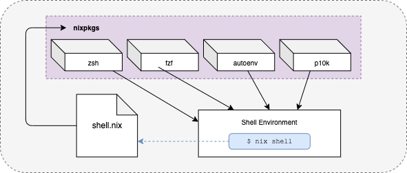

# Coder and Nix

## What is Coder

[Coder](https://coder.com) is an open source remote development platform that allows you to share an environment with your entire development team. Coder [eliminates many common issues](https://coder.com/why) with remote development by creating a shared environment for all your resources that is designed to streamline the development process for any type of development -- from DevOps and IT to Data Scientists. Additionally Coder is available through many of the popular cloud providers, allowing you to develop from anywhere using many different operating systems. 

Since Coder is designed to be a shared development platform for your team, it makes sense that Coder would work well with a tool like Nix. In fact, the team at [Coder uses Nix](https://coder.com/docs/v2/latest/CONTRIBUTING#requirements) for our development process 

## What is Nix?

Nix is a tool and operating system that treats every environment, including the os, as a list of dependencies. The Nix toolchain was created with the understanding that all software depends on other software to function. Because of this, Nix can let you set up your environment by declaring a list of dependencies. And according to [nix.dev](https://nix.dev/) this ecosystem aims to achieve reproducible development environments, seamless transfer of software environments between computers, and atomic upgrades and rollbacks. 

You can get started with the Nix package manager immediately on any OS. Instructions for installing Nix on your system are located at the [nix installation guide](https://nixos.org/download.html). 

Nix is a very robust, and at times complicated, platform. This article will attempt to describe how to use Nix with Coder at a high level. For additional information about Nix, please visit [https://nixos.org/](https://nixos.org/). 

### Benefits to using Nix

At its core, Nix aims to provide packages that are reproducible by isolating each package build. This means that the dependencies in each package exist in a separate environment from other packages. Nix is somewhat unique in that you may use the package management features of Nix without the full OS. Best of all, Nix can allow you to declare a default configuration for your system which can be transferred to any new machine using a shared configuration file. You can search for Nix packages at [search.nixos.org](https://search.nixos.org/).

The reproducibility of Nix environments allows development teams allowing developers to share configuration with teams [and contributors](https://coder.com/docs/v2/latest/CONTRIBUTING#requirements). Declarative Nix environments ensures that the environment will contain the same resources and tools for each developer on your team. 

Developers working with Nix won't have to worry about their builds failing due to outdated dependencies and can save time by avoiding resource-intensive workarounds. If you do happen to encounter an error with your Nix configuration you can roll back your Nix flake to the previous version to ensure your team can get work done right away. 


## What About Docker?

There are many benefits to using Docker to manage your development environment. You can prepare a Docker image with all the tooling needed to work on your app and have it ready to go with a basic `docker run` command. This environment ensures that all developers on your team are using the same version of the languages and resources that you need to maintain your application. 

Docker also helps to abstract away the gritty details of using a particular service or language. With Docker you wont need to manage each process independently - it is all included in the docker image. Docker is great for deploying applications, but it gets a bit complicated when using Docker to develop them. And using the same environment to develop and deploy your application can get very complicated very quickly. Each additional layer of complexity added to the development environment is another thing that can break without warning. 

However mixing this infrastructure with the development environment can sometimes limit the  developers ability to use the tools they are comfortable with. Developers must give up their preferred shell configuration and tooling in favor of a base set of tools and settings determined by the infrastructure. Many developers can pick up new tooling without much difficulty, but having a top-down approach to the development environment means not only are these tools fixed for the project, they may eventually break if the resources in the Dockerfile become outdated. 

Additionally, Docker requires that your team understands Docker and how it works to some degree. This is particularly important if something does happen to break within Docker -- your development team has to know how to troubleshoot the issue before they can resolve it. This is particularly difficult since Docker works differently between platforms. An issue one team member may have on Windows can be vastly different from issues MacOS based developers may face. And Docker has [quite a few issues running on MacOS](https://docs.docker.com/desktop/troubleshoot/known-issues/), especially with Apple's [new M1 chip](https://discussions.apple.com/thread/252268744). There is a potential for a huge amount of lost productivity when these issues come up, both in time and brainpower spent trying to fix the issue. And when its only your setup that doesn't work with Docker you find yourself facing the [it works on my machine](https://coder.com/blog/it-s-works-on-my-machine-explained) problem. 

You may also need to develop within the container itself, and you may loose your own personal development configuration. This configuration could be added to the docker container however your entire team would need to use this config and thus agree on the parts that may or may not be included. This becomes a problem when you  have a custom configuration or use different tools than the other members in the team. Yes, you can learn the tools used by the team as a whole, however your productivity may suffer for it. 

Nix solves this problem with the `nix-shell` command, and the associated `shell.nix` configuration files. 

### Bring Your Tools with Nix

As a developer using Nix as part of a project, you can bring your own tools by using Nix shell. By default, Docker does not allow you to bring your own custom configuration to the development environment. For example, say you have spent some time configuring your shell environment with themes and plugins. To use these tools with Docker you would have to add the shell configuration files to your Docker image, and everyone else on your team would need to use the same shell configuration. This becomes an issue if your teammates don't use the same tools and plugins. In order for you to use your own configuration you would have to maintain your own separate container containing your personal configuration and if that container fails, you are responsible for troubleshooting and fixing everything in order to continue development on your app. 

The nix-shell command resolves many of the uncertainties of the shared development process. You can use nix-shell from the command line by using the nix-shell command directly to install a package. For example, if you use the [fzf](https://github.com/junegunn/fzf) tool as a part of your workflow you can install it using the following command:

```bash
nix-shell -p fzf

```

The above command will add `fzf` to your local nix store and temporarily modify your $PATH variable to include the command in your shell. `fzf` will be available immediately. 

On the other hand, if you're getting started with nix and want to create an environment that contains many of your favorite tools you can create a `shell.nix` file. This file will contain the commands needed to make the tools available for your current session, and requires the Nix builtin function (nix calls these functions [derivations](https://nixos.org/manual/nix/stable/language/derivations.html)) `mkshell`. The following command will install `zsh`, `fzf`, `autoenv`, and the `powerlevel10k` theme.

```nix
# shell.nix

with (import <nixpkgs> {});
mkshell {
  buildInputs = [
    fzf
    zsh
    zsh-autoenv
    zsh-powerlevel10k
  ];
}
```

To use this `shell.nix` file you can run `nix-shell` without any arguments. The `nix-shell` tool will look for this file by default. 



### Adding Your Tools to A Shared `shell.nix` Configuration

The main benefit over using Docker for shared development environments is that Nix has the ability to extend this shared configuration with your own personal settings. For example, if you want to add your toolchain to a [nodejs.nix development environment](https://github.com/NixOS/nixpkgs/blob/master/pkgs/development/web/nodejs/nodejs.nix), you can modify your `shell.nix` file with the following code. Note that the `nodejs.nix` file is imported as part of the `buildInputs` array.

```nix
# shell.nix

with (import <nixpkgs> {});
mkshell {
  buildInputs = [
    (import ./nodejs.nix { inherit pkgs; })
    fzf
    zsh
    zsh-autoenv
    zsh-powerlevel10k
  ];
}
```

Now running the `nix-shell` command will create an environment containing the shared NodeJS nix configuration and your custom toolchain. 

## Using Nix with Coder

At this point you're ready to start using Nix with Coder. There are a few different ways you can combine thee two tools, but one really effective method to get the most of both environments is to run Coder within a Nix environment by using Docker. In this example we will be using modifying the Docker template in Coder to add the [nix-devcontainer image](https://github.com/xtruder/nix-devcontainer).

### NixOS Docker Template

Much of the functionality of Coder comes from the flexibility of [template](https://coder.com/docs/v2/latest/templates). To get started you will need to copy the Docker template in Coder. You copy this template using the Coder CLI by entering `coder templates init` into your terminal and selecting the `Develop in Docker` option. 

<!--  -->

```txt
> coder templates init
A template defines infrastructure as code to be provisioned for individual
developer workspaces. Select an example to be copied to the active directory:

Type to search

  > Develop in Docker
      Run workspaces on a Docker host using registry images
      https://github.com/coder/coder/tree/main/examples/templates/docker
```

`Develop in Docker` will create a directory named `docker` in your current directory.

<!--  -->

```txt
Extracting  docker  to ./docker...
Create your template by running:

   cd ./docker && coder templates create

Examples provide a starting point and are expected to be edited! 🎨
```

Next, navigate to the `docker` directory and edit the `Dockerfile` located at `build/Dockerfile`. We will edit this file to include the `nix-devcontainer` image and the `nix-shell` command mentioned earlier in the article. 

```dockerfile
FROM ghcr.io/xtruder/nix-devcontainer:v1
ARG USER=coder

RUN nix-shell
```

Finally, be sure to add your `shell.nix` file to the same directory as your `Dockerfile`, which is `build` in this example. Your `shell.nix` file should contain the following code

```nix
# shell.nix

with (import <nixpkgs> {});
mkshell {
  buildInputs = [
    (import ./nodejs.nix { inherit pkgs; })
    fzf
    zsh
    zsh-autoenv
    zsh-powerlevel10k
  ];
}
```

Your template is now set up and your `shell.nix` file has been copied to your template folder. Now you can upload your template to Coder using the `coder templates push` command in your terminal. 

Once this template is uploaded you can create a new [workspace](https://coder.com/docs/v1/latest/workspaces) in Coder that is running in a full NixOS environment that contains all of the tools you defined in your `shell.nix` file. 

### Using Other Applications

As a final step, lets say you have a Todo application you prefer to use alongside your code. You can clone this app and add it to Nix by doing the following: 

First, find project you would like to clone. In this example we are using the [Nix Todo MVC](https://github.com/nix-community/todomvc-nix).

## Conclusion

In this article you learned a bit about Coder and Nix, and how you can combine the two platforms to create a robust remote development environment that is reproducible and can be extended to incorporate your own tools. Nix and Coder both aim to provide developers with a worry-free environment, allowing your team to focus on work and not troubleshooting. 

Get started with Coder now by visiting [https://coder.com/](https://coder.com/).
