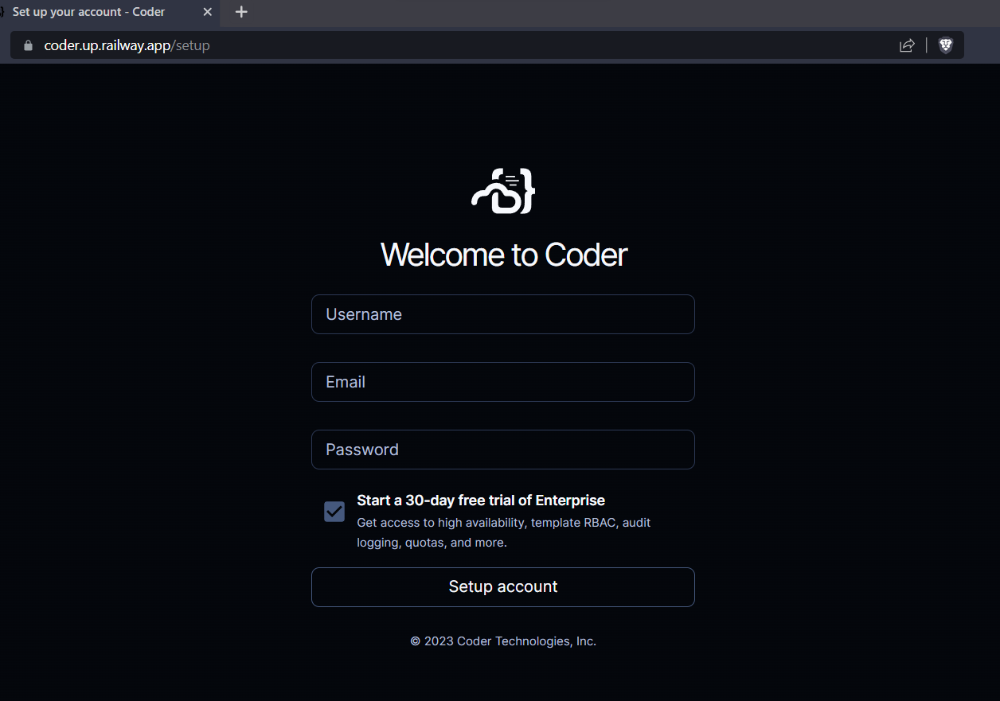
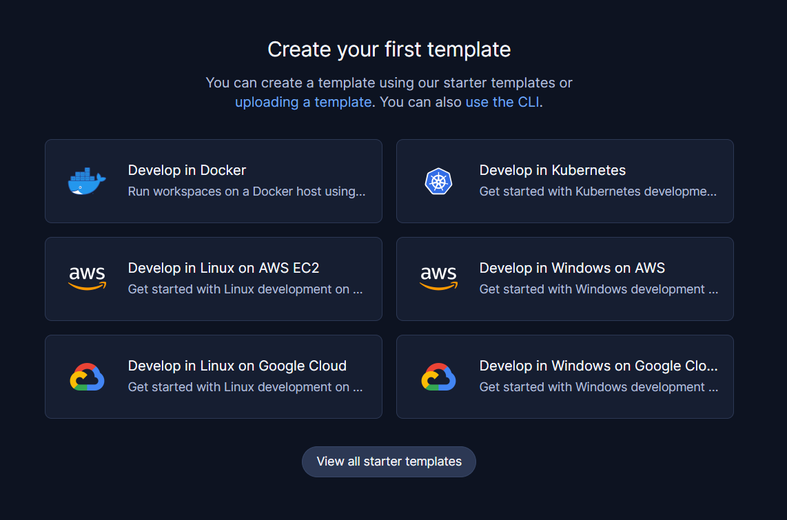
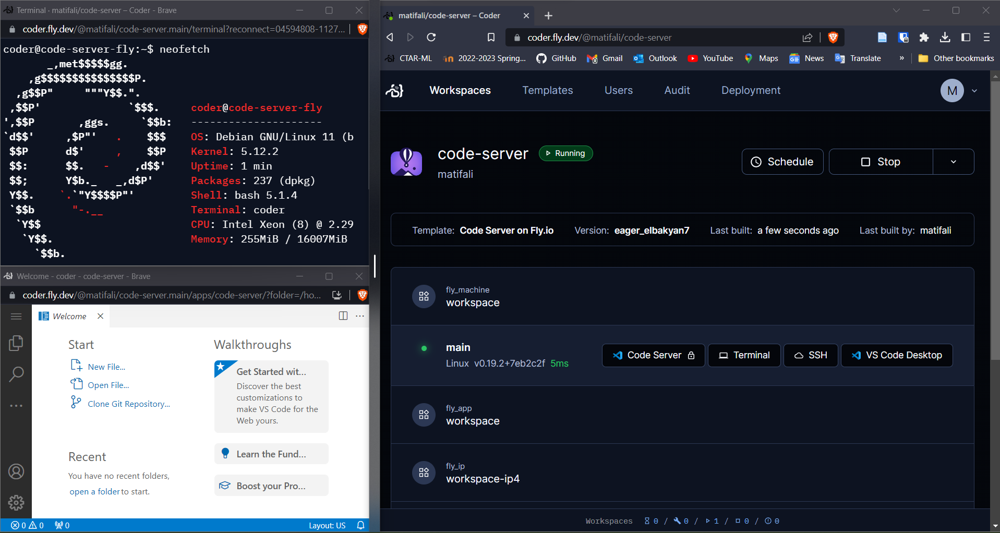

# Deploy Coder on Railway.app

Railway is a simple and powerful deployment platform that focuses on giving you and your team a deployment plane that radically increases developer efficiency. It is an Heroku alternative that focus on support and developer experience. A highly engaged community and Resource-based pricing, only pay for what you use. Railway has a range of templates to deploy your apps. It also has a free tier that you can use to deploy your apps for free. We have built and published a template for Coder on Railway.app. Coder can be deployed on Railway.app in just a few clicks. This guide will walk you through the process of deploying Coder on Railway.app.

## Quickstart

Start your deployment by clicking the button below. This will take you to Railway.app where you can sign up for a free account and deploy Coder.

### 1. Fill the environment variables

`CODER_WILDCARD_ACCESS_URL` is an optional environment variable which will allow you to forward ports from your workspace to a custom wildcard subdomain of the URL you provide. This is useful if you want to access a service running in your workspace from a browser. For example, if you set `CODER_WILDCARD_ACCESS_URL` to `*.coder.example.com`, you can access a service running on port 8080 in your workspace by visiting `8080--app-name-workspace-name-.coder.example.com` in your browser. See our [docs](https://coder.com/docs/v2/latest/admin/configure#wildcard-access-url) for details.

> Note: This is an optional step. If you do not set this variable, you will not be able to access services running in your workspace from a browser. For more information. You have to use a custom domain with Railway and cannot use railway's built-in domain for this wildcard.
> Note: You can set environment variables by going to _Dashboard &gt; Coder (Service) &gt; Settings &gt; Environment Variables_. See our [docs](https://coder.com/docs/v2/latest/cli/server) for more information on environment variables that can be set.

### 2. Attach a custom domain

Your Coder deployment will always be accessible at `https://<app-name>.up.railway.app`. If you want to use a custom domain, you can do so by going to Dashboard > Coder (Service) > Settings > Domains and adding your domain. Don't forget to attach your wildcard subdomain if you specified `CODER_WILDCARD_ACCESS_URL` in the previous step.

### 3. Create your first user

Create your first user by going to `https://<app-name>.up.railway.app` or your custom domain.

### 3. Create your first template

[**Templates**](https://coder.com/docs/v2/latest/templates): Templates are written in Terraform and describe the infrastructure for workspaces. Coder provides a set of starter templates to help you get started.

Choose a template to set up your first workspace. You can also [create your own templates](https://coder.com/docs/v2/latest/templates) to define your custom infrastructure with your preferred cloud provider.

### 4. Create your first workspace

[**Workspaces**](https://coder.com/docs/v2/latest/workspaces): Workspaces contain the IDEs, dependencies, and configuration information needed for software development. You can create workspaces from templates. Here wea are showing the workspaces created from the Fly.io starter template in action.

- [**Coder Docs**](https://coder.com/docs/v2) Documentation for Coder.
- [**VS Code Extension**](https://marketplace.visualstudio.com/items?itemName=coder.coder-remote): Open any Coder workspace in VS Code with a single click
- [**JetBrains Gateway Extension**](https://plugins.jetbrains.com/plugin/19620-coder): Open any Coder workspace in JetBrains Gateway with a single click
- [**Coder GitHub Action**](https://github.com/marketplace/actions/update-coder-template): A GitHub Action that updates Coder templates
- [**Various Templates**](https://github.com/coder/coder/examples/templates/community-templates.md): Hetzner Cloud, Docker in Docker, and other templates the community has built.
