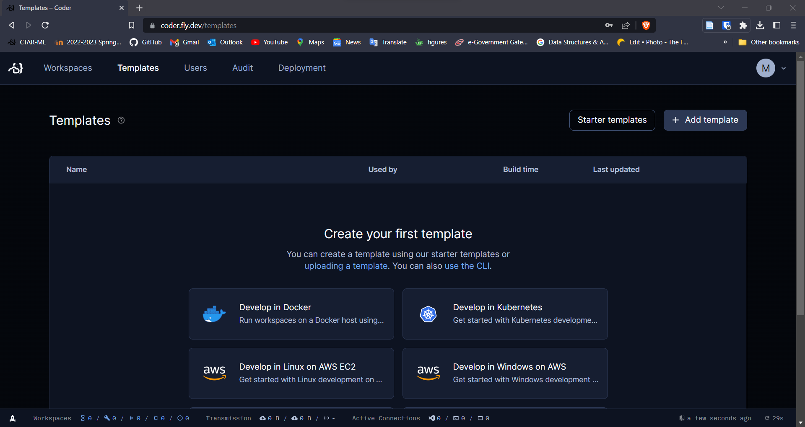

# Deploy Coder on Fly.io

Fly.io is a platform for deploying applications to the edge. It's a great fit for Coder because it's easy to deploy and scale, and it's easy to manage. In this guide, we'll walk through deploying Coder on Fly.io and creating workspaces as Fly.io (firecracker) machines.

## Prerequisites

- A Fly.io [account](https://fly.io/signup).
- [Fly CLI](https://fly.io/docs/getting-started/installing-flyctl/) installed on your machine.

## Deploy Coder

1. Log in to Fly.io with the CLI:

```bash
flyctl auth login
```

2. Create a new fly postgres database:

```bash
flyctl postgres create --name <postgres-app-name>
```

3. Create a new fly app:

```bash
flyctl apps create --name <app-name>
```

4. Connect to the database with the coder fly app:

```bash
flyctl postgres attach --app <app-name> <postgres-app-name>
```

**Important** Copy the connection string and save it for later.

1. Edit the `fly.toml` file and update as per the example below:

```toml
app = "<app-name>" # Replace <app-name> with the name of your app
kill_signal = "SIGINT"
kill_timeout = 5
primary_region = "ams"  # See a list of regions here: https://fly.io/docs/reference/regions/

[experimental]
  auto_rollback = true
  private_network = true  # Allows Coder to connect to the database

[build]
   image = "ghcr.io/coder/coder:latest"

[env]
  CODER_ACCESS_URL = "https://<app-name>.fly.dev" # Replace <app-name> with the name of your app
  CODER_HTTP_ADDRESS = "0.0.0.0:3000"
  CODER_PG_CONNECTION_URL = "DATABASE_URL" # Replace DATABASE_URL with the connection string you copied from step 4
  #CODER_VERBOSE = "true" # Uncomment this if you want to see more logs
  CODER_TELEMETRY_INSTALL_SOURCE = "fly.io"

[[services]]
  protocol = "tcp"
  internal_port = 3000
  processes = ["app"]

  [[services.ports]]
    port = 80
    handlers = ["http"]
    force_https = true

  [[services.ports]]
    port = 443
    handlers = ["tls", "http"]
  [services.concurrency]
    type = "connections"
    hard_limit = 25

```

6. Deploy the app:

Run the following command to deploy the app from the directory where the `fly.toml` file is located:

```bash
flyctl deploy
```

7. Scale the Coder app to 1GB of memory:

```bash
flyctl scale memory 1024 --app <app-name>
```

8. Congratulations! You've deployed Coder on Fly.io!. Go to the URL of your app and create your first user!

> If you want to use a custom domain, you can do so by following the instructions [here](https://fly.io/docs/app-guides/custom-domains-with-fly/).
> 

## Create your first template

A template is a set of instructions that Coder uses to create a workspace. In this section, we'll create a template that uses a Fly.io machine as the workspace.

1. Install Coder locally by following the instructions [here](https://coder.com/docs/v2/latest/install) or if you are on linux/macOS, you can run the following command:

```bash
curl -fsSL https://coder.com/get-coder.sh | bash
```

2. Login to Coder:

```bash
coder login <coder-url>
```

3. Create a new template by running the following command and following the prompts:

```bash
coder templates init
```

4. Choose the `fly-docker-image` template and cd into the `fly-docker-image` directory.

5. Create the new template by running the following command from the `fly-docker-image` directory:

```bash
coder templates push fly-docker-image --variable fly_api_token=$(flyctl auth token)
```

> instead of setting variable `fly_api_token` you can also set a fly.io secret with the name `FLY_API_TOKEN`
>
> ```bash
> flyctl secrets set FLY_API_TOKEN=$(flyctl auth token)
> ```

6. Go to the Coder UI and create a new workspace using the `fly-docker-image` template.

7. This will deploy code-server on a Fly.io machine using the docker image. You can access the code-server instance by clicking on the `Code Server` button.

## Update Coder

To update the Coder version, run `flyctl deploy --aap <app-name>` again and it will pull the latest version of Coder.

## Next Steps

> To modify or write your first coder template, check out the [template docs](https://coder.com/docs/v2/latest/templates).
