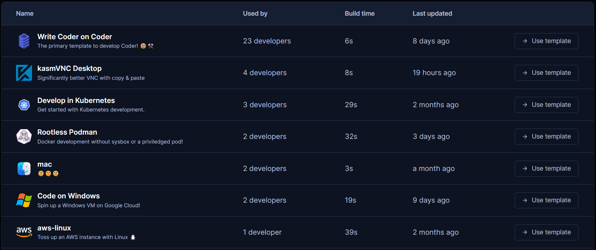
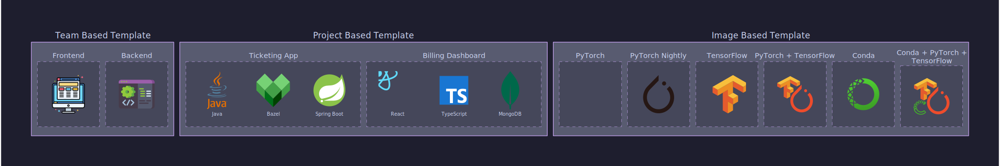
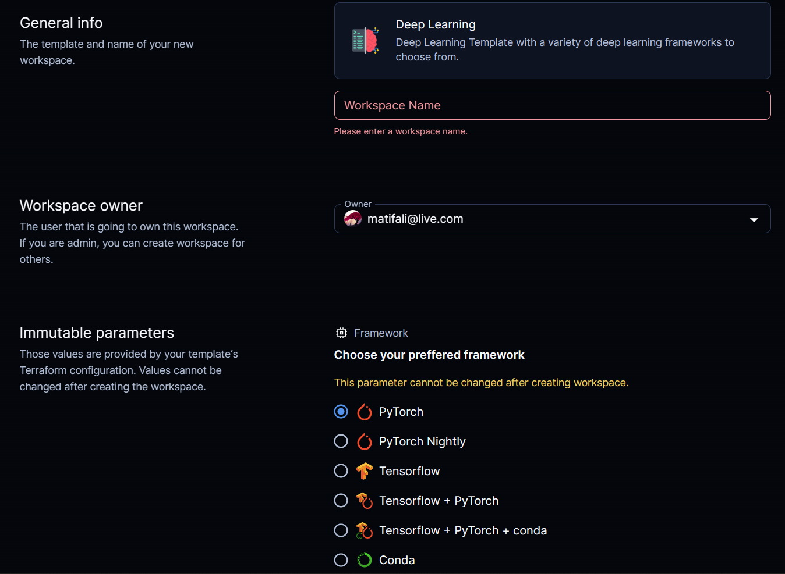
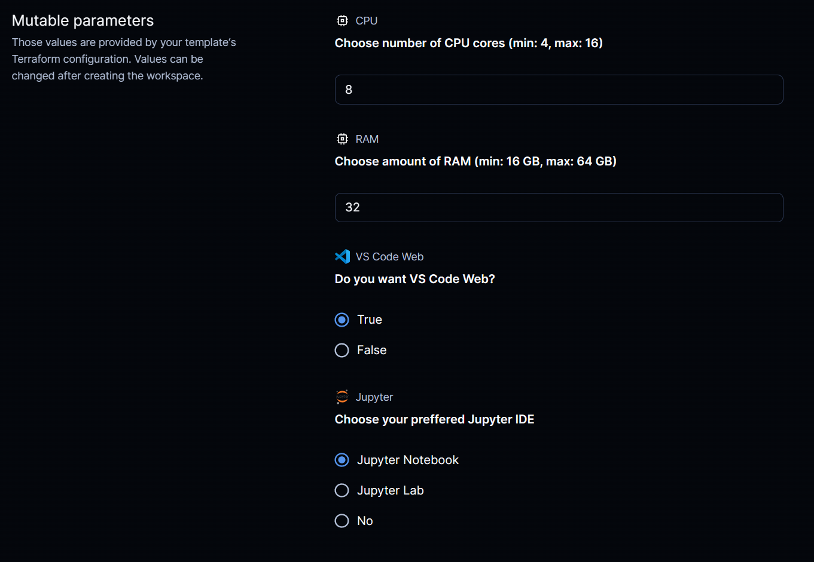

# Managing Coder templates

Coder templates are the DNA used to create workspaces. They are typically managed by a platform/infrastructure group and allow developers to focus on their projects instead of the underlying infrastructure for their workspaces.

[](./static/templates.png)

## Organizing your templates

There are many ways to organize your templates:

- **Team based templates**: A template for each of your teams (e.g. a template for your _frontend_ team and a template for your _backend_ team.)

- **Project based templates**: A template for each of your projects (e.g. a template for your _cool-project_ and a template for your _awesome-project_.)

- **Image based templates**: A single template that is used for all your projects but with a different image for each project.



## What is the difference between a template and an image?

A template is a collection of infrastructure as code (Terraform) used to create workspaces. An image is a collection of software (e.g. Docker) that is used to create a workspace. A template can use one or more images. For example, you can have a template that uses the _golang_ image and the _node_ image, and the user will have the choice of which image to use when creating a workspace. Choices are managed by a terraform variable:

```hcl
variable "image" {
    type        = string
    description = "The image to use for the workspace"
    default     = "node"
    validation {
    condition     = contains(["node", "java"], var.image)
      error_message = "The image must be either ubuntu or node"
  }
}
```

## Creating your first template

1. Create a new repository in your GitHub account. This will be the repository that contains your Coder templates.

2. Create a new directory in your repository called `deeplearning`.

3. Create a new file in the `deeplearning` directory called `main.tf`. This is the terraform file that will be used to create your template.

```hcl
terraform {
  required_providers {
    coder = {
      source = "coder/coder"
      version = "0.6.14"
    }
    docker = {
      source = "kreuzwerker/docker"
      version = "3.0.1"
    }
  }
}
...
```





4. Create a rich-parameter variable of the form `data coder_parameter <name>`. This will be used to create a rich parameter in the template. For example:

   > See full list of available parameters [here](https://registry.terraform.io/providers/coder/coder/latest/docs/data-sources/parameter)

```hcl
  data "coder_parameter" "framework" {
    name        = "Framework"
    icon        = "https://raw.githubusercontent.com/matifali/logos/main/memory.svg"
    description = "Choose your preffered framework"
    type        = "string"
    mutable     = false
    default     = "no-conda"
    option {
      name        = "PyTorch"
      description = "PyTorch"
      value       = "pytorch"
      icon        = "https://raw.githubusercontent.com/matifali/logos/main/pytorch.svg"
    }
    option {
      name        = "PyTorch Nightly"
      description = "PyTorch Nightly"
      value       = "pytorch-nightly"
      icon        = "https://raw.githubusercontent.com/matifali/logos/main/pytorch.svg"
    }
    option {
      name        = "Tensorflow"
      description = "Tensorflow"
      value       = "tensorflow"
      icon        = "https://raw.githubusercontent.com/matifali/logos/main/tensorflow.svg"
    }
    option {
      name        = "Tensorflow + PyTorch"
      description = "Tensorflow + PyTorch"
      value       = "no-conda"
      icon        = "https://raw.githubusercontent.com/matifali/logos/main/tf-torch.svg"
    }
    option {
      name        = "Tensorflow + PyTorch + conda"
      description = "Tensorflow + PyTorch + conda"
      value       = "conda"
      icon        = "https://raw.githubusercontent.com/matifali/logos/main/tf-torch-conda.svg"
    }
    option {
      name        = "Conda"
      description = "Only conda (install whatever you need)"
      value       = "conda-base"
      icon        = "https://raw.githubusercontent.com/matifali/logos/main/conda.svg"
    }
  }
```

5. For this example, we will use the pre-built [DockerDL](https://github.com/matifali/dockerdl) images.

> **Note**: You can use any image you want. You can use a pre-built image or coder can build an image for you from the Dockerfile in _images_ directory. See

```hcl
data "docker_registry_image" "dockerdl" {
  name = "matifali/dockerdl:${data.coder_parameter.framework.value}"
}

resource "docker_image" "dockerdl" {
  name          = data.docker_registry_image.dockerdl.name
  pull_triggers = [data.docker_registry_image.dockerdl.sha256_digest]
  # Keep alive for other workspaces to use upon deletion
  keep_locally = true
}

```

> Full example is available [here](https://github.com/matifali/coder-templates/blob/main/deeplearning/main.tf)

## Next steps

[How to keep your templates up to date](./keep-up-to-date): A guide on how to keep your templates up to date with the latest changes in the upstream repository using GitHub Actions. This will allow you to keep your templates up to date without having to manually update them. [Read more](./keep-up-to-date)
