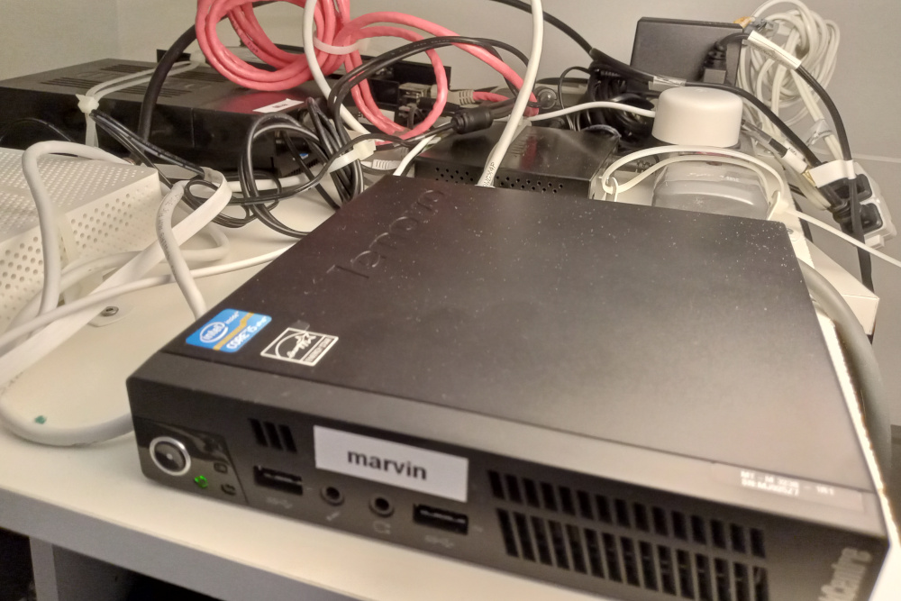
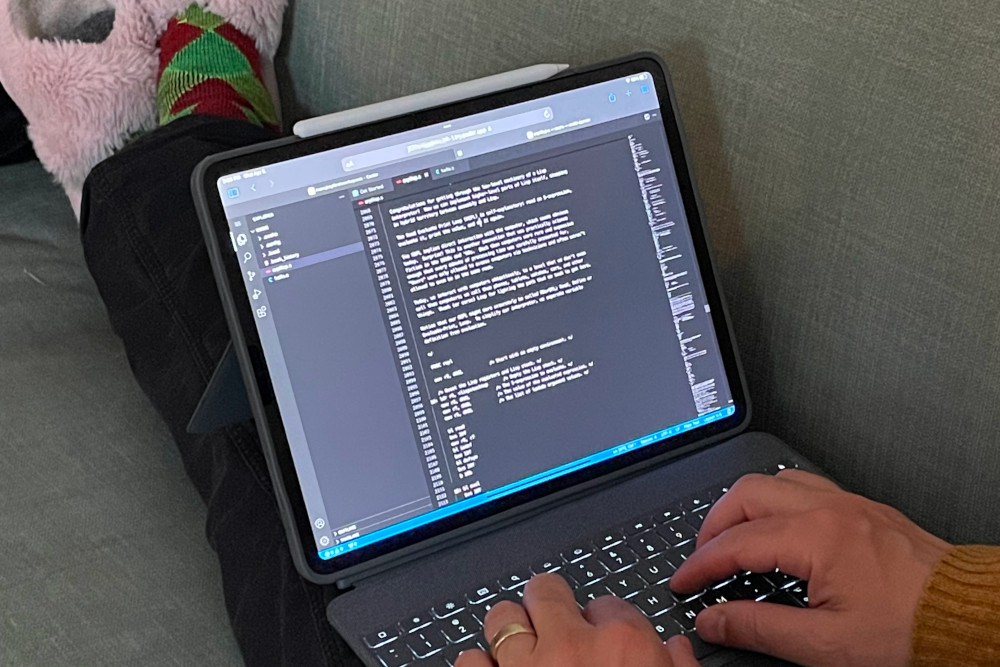

# Run Coder in a self-hosted homelab

I outgrew my little homelab. I have a couple of [ODROID-HC2](https://ameridroid.com/products/odroid-hc2) devices in a closet for serving files and experimenting with ARM assembly. They work great but they’re small, single board computers with matching small capacity.

It was time to expand my homelab to handle my dev projects too.

## My problem: I wasn't getting anywhere

I was spending too much time working around my project's obstacles instead of working on them. They're spread out over several environments and places:

* They run on OpenBSD, Windows, Linux, ARM, python3, browsers, and command-line tools.
* I’m typing right now on an OpenBSD laptop. I sometimes use a Windows laptop. The ODROIDs are almost literally chained to my homelab closet.
* I work from home, a co-work space, and sometimes other time zones.

In other words, my location and the machine I use put a limit on the projects I could work on at any given time.

A good solution would let me self-host my projects and work on them wherever and however I want. A better solution would also let me use an iPad for the [ultimate sofa software development rig](https://coder.com/blog/a-guide-to-writing-code-on-an-ipad).

I put off fixing this because I expected to hack and contort different tools into something that might eventually approach what I wanted. The cure seemed worse than the disease.

## I discovered Coder

It turns out that [Coder](https://coder.com/docs/v2) is a much easier solution. Coder solves big problems for big enterprise dev teams. And I discovered that it can solve my problems:

- An isolated workspace for each project, no matter the environment
- Secure, remote access
- Flexibility of handling cloud and on-prem workspaces
- Administering all these workspaces from a single place
- Easy to install
- Runs on modest hardware
- Bonus: [Open source](https://github.com/coder)!

## First, the hardware

My homelab would need more hardware. I found a used [Lenovo m92P Tiny](https://www.lenovo.com/il/en/desktops/thinkcentre/m-series-tiny/m92p) with 16 GB RAM and upgraded its spinning disk with a 1 TB SSD, all for $200. I named it "Marvin", a character from my favorite movie.

I installed [Debian](https://www.debian.org/intro/why_debian) and crammed Marvin into the homelab closet. Marvin’s only connection to the outside world is an ethernet cable.




## Install Docker then Coder

I ssh'd into Marvin to get started.

First I installed Docker, before Coder. You'll see why in two paragraphs.

Instead of [Docker Desktop](https://www.docker.com/products/docker-desktop/), I installed [Docker Engine for Debian](https://docs.docker.com/engine/install/debian/) because Marvin is headless. I'm not missing out on Docker Desktop's GUI since Coder does a lot of Docker management for me.

Next was Coder. Its [install script](https://coder.com/docs/v2/latest/install/install.sh) does the right thing. In Marvin’s case it detected Debian to install a `.deb` package. It also recognized Docker so it added the `coder` user to the `docker` group.

```bash
marc@marvin:~$ sudo curl -fsSL https://coder.com/install.sh | sh
[sudo] password for marc:
Debian GNU/Linux 11 (bullseye)
Installing v0.18.1 of the amd64 deb package from GitHub.
# Installation progress...
deb package has been installed.
# Info for next steps, including setting up Coder as a systemd server...
marc@marvin:~$
```

I wanted to dedicate Marvin to hosting my projects, so I followed the installer's suggestion to run Coder [as a system service](https://coder.com/docs/v2/latest/admin/configure#system-packages):

```bash
marc@marvin:~$ sudo systemctl enable --now coder
```

Accessing Coder is straightforward:

- [Command line tool](https://coder.com/docs/v2/latest/cli)
- Web user interface that I can access on my home network with Marvin's local IP address
- Publicly accessible, encrypted tunnel based on [Tailscale](https://coder.com/docs/v2/latest/networking)
- An [API](https://coder.com/docs/v2/latest/api)

I got the [tunnel’s access URL](https://coder.com/docs/v2/latest/admin/configure) (and checked that Coder is up and running):

```bash
marc@marvin:~$ sudo journalctl -u coder.service -b
# Log entries from Coder
Mar 09 14:22:21 marvin coder[617]: Opening tunnel so workspaces can connect to your deployment. For production scenarios, specify an external access URL
Mar 09 14:22:22 marvin coder[617]: View the Web UI: https://marvin-access-url.pit-1.try.coder.app
# More log entries from Coder
```

## Using Coder for the first time

At this point I was able to use my laptop's browser to log in to Coder. I opened a tab with the access URL and was asked to set up an account. This account is only for Marvin's instance of Coder.


Once logged in, I was ready to set up my first workspace. A Coder [workspace](https://coder.com/docs/v2/latest/workspaces) is a runnable environment that a developer, well, develops in. Each developer has their own workspace (or workspaces).

A developer can connect to a workspace from their [favorite IDE](https://coder.com/docs/v2/latest/ides) and dev tools. That includes browser-based [VS Code](https://coder.com/docs/code-server/latest), [LSP](https://langserver.org/) servers, and local JetBrains or Emacs.

## Create a template

Before I could start a workspace, I needed to create a [template](https://coder.com/docs/v2/latest/templates). A template is the collection of settings that Coder uses to create new workspaces. You only have to set up a template once to create as many workspaces as you need from it.

A Coder template is a [Terraform](https://www.terraform.io/) file. That means that a Coder workspace can be whatever you can provision with Terraform. For big dev teams, that can be as sophisticated as pods in a [Kubernetes](https://coder.com/docs/v2/latest/platforms/kubernetes) cluster.

Or when an ephemeral container won't do, like when a project is more "pet" than "cattle" or the project needs fuller access to the OS and hardware, a template can provision a virtual machine with [Proxmox VE](https://github.com/bpmct/coder-templates/tree/main/proxmox-vm). This way, the developer can treat the workspace like a full computer but still manage it like any other workspace.

Coder comes with a few templates out of the box. These templates include cloud computing like [Fly.io](https://coder.com/blog/remote-developer-environments-on-fly-io), Digital Ocean, Azure, Google Cloud, and AWS.

For Marvin, I'd just be using Docker.

For my first workspace, I wanted to keep things simple with a template that would let me self-host with Docker. I selected **Templates** then **Starter Templates**.


In **Starter Templates** I selected [Develop in Docker](https://github.com/coder/coder/tree/main/examples/templates/docker).


I went back to Marvin's shell to set up my template, starting with authentication:

```bash
marc@marvin:~$ coder login https://marvin-access-url.coder.app
Open the following in your browser:

        https://marvin-access-url.coder.app/cli-auth

> Paste your token here:
> Welcome to Coder, marc! You're authenticated.
```

Then I followed the instructions to create a Docker template. This template creates a directory named `docker`:

```bash
marc@marvin:~$ coder templates init
# Follow instructions to choose Develop in Docker...
Create your template by running:

   cd ./docker && coder templates create

Examples provide a starting point and are expected to be edited!
```

This starter template uses the vanilla [Ubuntu container image](https://hub.docker.com/_/ubuntu/). Normally at this point, I would have customized the template for a project by editing the Terraform file, `main.tf`, in the `docker` directory:

```bash
marc@marvin:~$ ls docker
main.tf  README.md
```

Next, I followed Coder's instructions to create the template:

```bash
marc@marvin:~$ cd ./docker && coder template create
> Upload "~/docker"? (yes/no) yes
# Progress info...
┌────────────────────────────────┐
│ Template Preview               │
├────────────────────────────────┤
│ RESOURCE                       │
├────────────────────────────────┤
│ docker_container.workspace     │
│ └─ main (linux, amd64)         │
├────────────────────────────────┤
│ docker_image.main              │
├────────────────────────────────┤
│ docker_volume.home_volume      │
└────────────────────────────────┘
> Confirm create? (yes/no) yes
The docker template has been created at Mar 09 14:28:39! Developers can
provision a workspace with this template using:

   coder create --template="docker" [workspace name]

marc@marvin:~/docker$
```

There! The web interface confirmed that the template was ready to go:


## Create a workspace

I was then able to create a workspace from my first template. I selected **Workspaces** then **Create from template**:


I filled in details about my first workspace then started it:


Marvin took a couple of minutes as Coder prepared the workspace for the first time, including downloading the Docker image. After that starting the workspace would take only a few seconds.

That got me my first workspace, running and ready to use! I could access it in a few ways, including [code-server](https://coder.com/docs/code-server/latest), which lets me use VS Code in the browser.


Out of curiosity, I went back to Marvin's shell to confirm that Docker was running my workspace:

```bash
marc@marvin:~/docker$ docker ps
CONTAINER ID   IMAGE                                        COMMAND                  CREATED         STATUS         PORTS     NAMES
9fed4695ac59   coder-4868739b-5bc8-421c-123f-59fd8d2581ab   "sh -c '#!/usr/bin/e…"   7 minutes ago   Up 7 minutes             coder-marc-myfirstworkspace
```

## Where to go from here

I can finally go places while my homelab hosts my projects at home. Coder's public access URL for Marvin lets me work wherever I want.

And I can finally work on my projects however I want.



For the next step, I'll set up some of my projects as Coder workspaces on my homelab:

* Static web site generator: Create a template with [persistence](https://coder.com/docs/v2/latest/templates/resource-persistence) and add [Pelican](https://getpelican.com/) to the template's Docker image.
* ARM assembly: Create a template that provisions an ODROID.
