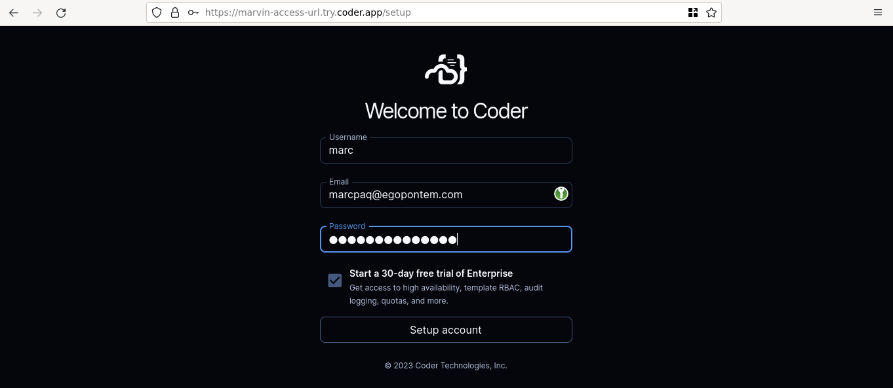
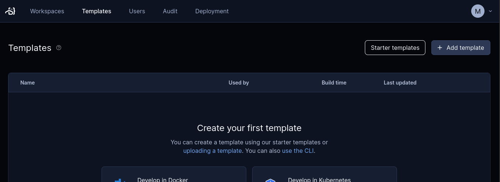
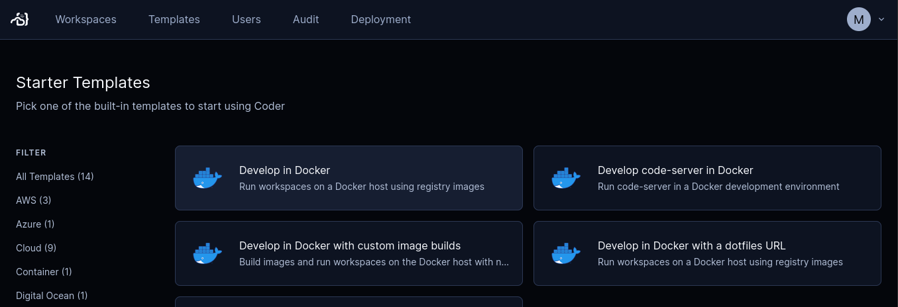
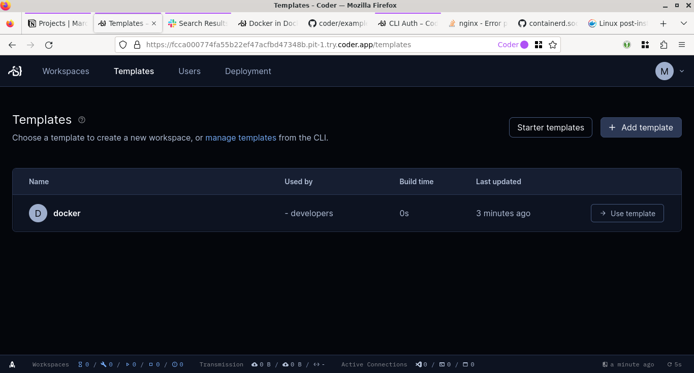
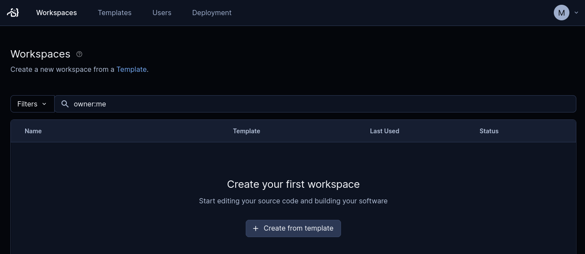
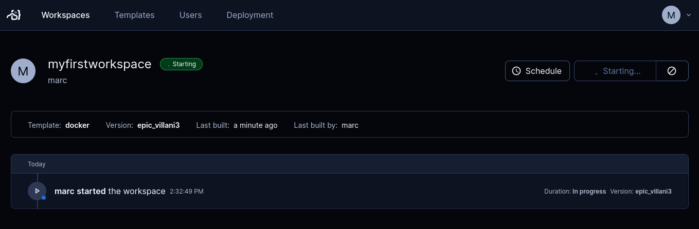
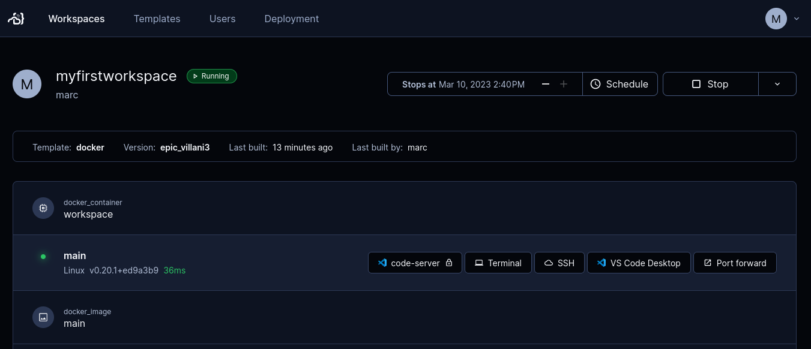

# Run Coder in a self-hosted homelab

I outgrew my little homelab. I have a couple of [ODROID-HC2](https://ameridroid.com/products/odroid-hc2) devices in a closet. I use them to serve files and experiment with ARM assembly. They work great but they’re small, single board computers with equally small capacity.

It was time to expand my homelab to handle my dev projects too.

## My problem: I wasn't getting anywhere

I was spending too much time managing my personal and work projects instead of working on them. They're spread out over several environments and places. They run on OpenBSD, Windows, Linux, ARM, python3, browsers, and old-school command-line tools. The ODROIDs are almost literally chained to my homelab closet. I work from home, a co-work space, and sometimes other cities and countries.

The ideal solution would let me self-host my projects and let me work on them wherever and however I want. My daily driver, the machine I’m typing on right now, is an OpenBSD laptop. I sometimes use a Windows laptop. I run Linux on the ODROIDs. And I also wanted to use an iPad for the [ultimate sofa software development rig](https://coder.com/blog/a-guide-to-writing-code-on-an-ipad).

I put off fixing this because I expected that I'd have to hack and contort different tools into something that might eventually approach what I wanted. The cure seemed worse than the disease.

## I discovered Coder

It turns out that [Coder](https://coder.com) is a much easier solution. Coder solves big problems for big enterprise dev teams. And I discovered that it can solve my problem too:

- An isolated workspace for each project, no matter the environment
- Secure, remote access
- Flexibility of handling cloud and on-prem projects
- Administering all these projects from a single place
- Easy to install
- Runs on modest hardware
- Bonus: Open source!

## First, the hardware

My homelab would need more hardware. I found a used [Lenovo m92P Tiny](https://www.lenovo.com/il/en/desktops/thinkcentre/m-series-tiny/m92p) with 16 GB RAM and upgraded its spinning disk with a 1 TB SSD, all for $200. I named it "Marvin", a character from my favorite movie.

I installed Debian GNU/Linux and tucked Marvin into the homelab closet. Marvin’s only connection to the outside world is an ethernet cable.

## Install Docker then Coder

I ssh'd into Marvin to get started.

I installed Docker before Coder. You'll see why later.

Instead of [Docker Desktop](https://www.docker.com/products/docker-desktop/), I installed [Docker Engine for Debian](https://docs.docker.com/engine/install/debian/) because Marvin is headless. I'm not missing out on Docker Desktop's admin features since Coder has its own capable browser-based UI and it does a lot of Docker management for me.

Next was Coder. Its [install script](https://coder.com/docs/v2/latest/install/install.sh) does the right thing. In Marvin’s case it detected Debian to install a `.deb` package. It also handles other Linux distros.

The installer also recognized Docker, including adding the `coder` user to the `docker` group.

```bash
marc@marvin:~$ sudo curl -fsSL https://coder.com/install.sh | sh
[sudo] password for marc:
Debian GNU/Linux 11 (bullseye)
Installing v0.18.1 of the amd64 deb package from GitHub.
# Installation progress...
deb package has been installed.
# Info for next steps, including setting up Coder as a systemd server...
marc@marvin:~$
```

I wanted to dedicate Marvin to hosting my projects, so I followed the installer's suggestion to run Coder [as a service](https://coder.com/docs/v2/latest/admin/configure#system-packages):

```bash
marc@marvin:~$ sudo systemctl enable --now coder
```

Accessing Coder is straightforward. I can access the web interface with Marvin's local IP address. And by default, Coder also set up a publicly accessible, encrypted tunnel based on [Tailscale](https://tailscale.com). I got the [tunnel’s access URL](https://coder.com/docs/v2/latest/admin/configure) (and checked that Coder is up and running):

```bash
marc@marvin:~$ sudo journalctl -u coder.service -b
# Log entries from Coder
Mar 09 14:22:21 marvin coder[617]: Opening tunnel so workspaces can connect to your deployment. For production scenarios, specify an external access URL
Mar 09 14:22:22 marvin coder[617]: View the Web UI: https://marvin-access-url.pit-1.try.coder.app
# More log entries from Coder
```

## Using Coder for the first time

At this point I was able to use my laptop's browser to log in to Coder. I opened a tab with the access URL and was asked to set up an account. This account is for Marvin's instance of Coder only.



Once logged in, I was ready to set up my first workspace. A Coder [workspace](https://coder.com/docs/v2/latest/workspaces) is the runnable environment that a developer, well, works in. Each developer has their own workspace or even workspaces.

Before I could start a workspace, I needed to create a [template](https://coder.com/docs/v2/latest/templates). A template is the collection of settings that Coder uses to create new workspaces. You only have to set up a template once to create as many workspaces as you need from it.

A Coder template is a [Terraform](https://www.terraform.io/) file. So a Coder workspace can be pretty much whatever you can provision with Terraform.

Coder comes with a few templates out of the box. These templates include cloud computing like [Fly.io](https://coder.com/blog/remote-developer-environments-on-fly-io), Digital Ocean, Azure, Google Cloud, and AWS.

For my first workspace, I wanted to keep things simple with a template that would let me self-host with Docker. I selected **Templates** then **Starter Templates**.



In **Starter Templates** I selected [Develop in Docker](https://github.com/coder/coder/tree/main/examples/templates/docker).



This starter template uses the vanilla [Ubuntu container image](https://hub.docker.com/_/ubuntu/). For a real template, I'd edit its Terraform file to provision an environment for one of my projects.

I went back to Marvin's shell to set up my template, starting with authentication:

```bash
marc@marvin:~$ coder login https://marvin-access-url.coder.app
Open the following in your browser:

        https://marvin-access-url.coder.app/cli-auth

> Paste your token here:
> Welcome to Coder, marc! You're authenticated.
```

Then I followed the instructions to create a Docker template:

```bash
marc@marvin:~$ coder templates init
# Follow instructions to choose Develop in Docker...
Create your template by running:

   cd ./docker && coder templates create

Examples provide a starting point and are expected to be edited!
marc@marvin:~$ cd ./docker && coder template create
> Upload "~/docker"? (yes/no) yes
# Progress info...
┌────────────────────────────────┐
│ Template Preview               │
├────────────────────────────────┤
│ RESOURCE                       │
├────────────────────────────────┤
│ docker_container.workspace     │
│ └─ main (linux, amd64)         │
├────────────────────────────────┤
│ docker_image.main              │
├────────────────────────────────┤
│ docker_volume.home_volume      │
└────────────────────────────────┘
> Confirm create? (yes/no) yes
The docker template has been created at Mar 09 14:28:39! Developers can
provision a workspace with this template using:

   coder create --template="docker" [workspace name]

marc@marvin:~/docker$
```

There! The web interface confirmed that the template was ready to go:



I was then able to create a workspace from my first template. I selected **Workspaces** then **Create from template**:



I filled in details about my first workspace then started it:



Marvin took a couple of minutes while Coder prepared the workspace, including downloading the Docker image.

That got me my first workspace, running and ready to use!



Out of curiosity, I went back to Marvin's shell to confirm that Docker was running my workspace:

```bash
marc@marvin:~/docker$ docker ps
CONTAINER ID   IMAGE                                        COMMAND                  CREATED         STATUS         PORTS     NAMES
9fed4695ac59   coder-4868739b-5bc8-421c-123f-59fd8d2581ab   "sh -c '#!/usr/bin/e…"   7 minutes ago   Up 7 minutes             coder-marc-myfirstworkspace
```

From my browser's Coder tab I could access my workspace in a few ways, including [code-server](https://coder.com/docs/code-server/latest), which lets me use VS Code in the browser.

## Where to go from here

I can finally go places now that I can leave Marvin at home. Coder's public access URL for Marvin lets me work wherever I want.

And I can finally work on my projects however I want.

[ pic of Coder on an iPad ]

For the next step, I'll set up some of my projects as Coder workspaces on my homelab:

* Put my static web site generator in a Docker image
* Provision one of the ODROIDs as a Coder workspace

