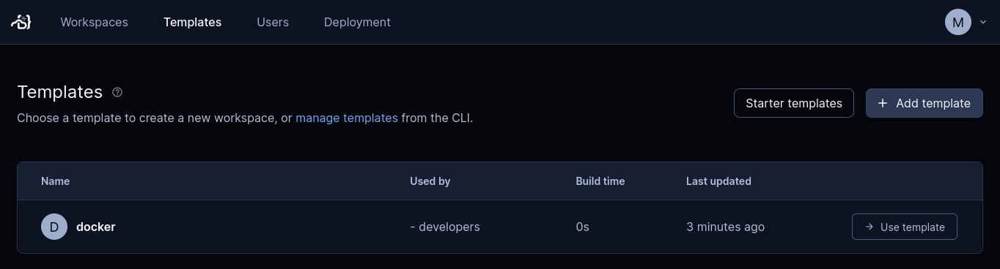

# Run Coder in a self-hosted homelab

I outgrew my modest homelab. To serve files and media I have a couple of [ODROID-HC2](https://ameridroid.com/products/odroid-hc2) devices in a closet. They work great but they’re running at full capacity.

My needs have expanded to more than just file storage. It was time to expand my homelab to handle my dev projects too.

## My problem: I can’t go anywhere

My personal and work projects are spread out over several environments and places. My projects run on OpenBSD, Windows, Linux, arm64, python3, browsers, and old-school command-line tools. I work from home, a co-work space, and sometimes other cities and countries. My  Raspberry Pi is deliciously small, but carrying one around is a pain.

The ideal solution would let me self-host my projects while letting me work on them wherever and however I want. My daily driver, the machine I’m typing on right now, is an OpenBSD laptop. I sometimes use a Windows laptop. And I also wanted to use an iPad for the [ultimate sofa software development
rig](https://coder.com/blog/a-guide-to-writing-code-on-an-ipad).

## I discovered Coder

Most solutions for a homelab mean connecting different tools to get something that could eventually approach what I wanted if I had the luxury of spending enough time on it.

Turns out that it's easy with [Coder](https://coder.com). Coder solves big problems for big enterprise dev teams. And I discovered that it can solve my problems too:

- An isolated workspace for each project, no matter the environment
- Secure, remote access
- Flexibility of handling cloud and on-prem projects
- Administering all these projects from a single place
- Easy to install and run on modest hardware
- Bonus: Open source!

## First, the hardware

I needed new hardware for my homelab. I found a used [Lenovo m92P Tiny](https://www.lenovo.com/il/en/desktops/thinkcentre/m-series-tiny/m92p) with 16 GB RAM and upgraded its spinning disk with a 1 TB SSD, all for $200. I named it "Marvin", a character from my favorite movie.

I installed Debian GNU/Linux and tucked Marvin into the homelab closet. Marvin’s only connection to the outside world is with an ethernet cable.

## Install Docker then Coder

I ssh'd into Marvin to get started.

First, I installed Docker before Coder. You'll see why later.

Instead of [Docker Desktop](https://www.docker.com/products/docker-desktop/), I installed [Docker Engine for Debian](https://docs.docker.com/engine/install/debian/) because Marvin is headless so I'll only use him remotely. Besides, Coder already does a lot of Docker management for me with its built-in web interface.

Next was Coder. It's surprisingly easy to set up. Its [install script](https://coder.com/docs/v2/latest/install/install.sh) does the right thing. In Marvin’s case it detects Debian to install a .deb package. It can also handle other Linux distros, too. The installer also recognizes Docker, including adding the `coder` user to the `docker` group.

```bash
marc@marvin:~$ sudo curl -fsSL https://coder.com/install.sh | sh
[sudo] password for marc: 
Debian GNU/Linux 11 (bullseye)
Installing v0.18.1 of the amd64 deb package from GitHub.
# Installation progress...
deb package has been installed.
# Info for next steps, including setting up Coder as a systemd server...
marc@marvin:~$
```

I wanted to dedicate Marvin to my self-hosted projects, so I set up Coder to run as a service. I followed the installer's suggestion:

```bash
marc@marvin:~$ sudo systemctl enable --now coder
```

By default, Coder also sets up a publicly accessible tunnel for me. I got the [tunnel’s access URL](https://coder.com/docs/v2/latest/admin/configure) (and checked that Coder is up and running):

```bash
marc@marvin:~$ sudo journalctl -u coder.service -b
# Log entries from Coder
Mar 09 14:22:21 marvin coder[617]: Opening tunnel so workspaces can connect to your deployment. For production scenarios, specify an external access URL
Mar 09 14:22:22 marvin coder[617]: View the Web UI: https://marvin-access-url.pit-1.try.coder.app
# More log entries from Coder
```

## Using Coder for the first time

At this point I was able to use my laptop's browser to log in to Coder running on Marvin. I opened a tab with the access URL and was asked to set up an account. This account is for Marvin's instance of Coder only.


Once logged in, I was ready to set up my first workspace. A Coder workspace is the runnable environment that a developer, well, works in. Each developer has their own workspace. Developers can even work from a variety of workspaces.

Before I could start a workspace, I needed to [create a template](https://coder.com/docs/v2/latest/templates). A template is the collection of settings that Coder uses to create new workspaces. You only have to set up a template once to create as many workspaces as you need.

A Coder template is actually a [Terraform](https://www.terraform.io/) file. So a Coder workspace can be pretty much whatever you can provision with Terraform.

For my first template, I wanted to keep things simple. Coder comes with a few templates out of the box. I selected **Templates** then **Starter Templates**.


In **Starter Templates** I selected [Develop in Docker](https://github.com/coder/coder/tree/main/examples/templates/docker):


This starter template uses the vanilla [Ubuntu container image](https://hub.docker.com/_/ubuntu/). For a real template, I'd edit it to provision the environment for a project.

I went back to Marvin's shell to set up my template, starting with authentication:

```bash
marc@marvin:~$ coder login https://marvin-access-url.coder.app
Open the following in your browser:

        https://marvin-access-url.coder.app/cli-auth

> Paste your token here:
> Welcome to Coder, marc! You're authenticated.
```

Now I can create the docker template:

```bash
marc@marvin:~$ coder templates init
# Progress info and further instructions...
marc@marvin:~$ cd ./docker && coder template create
> Upload "~/docker"? (yes/no) yes
# Progress info...
┌────────────────────────────────┐
│ Template Preview               │
├────────────────────────────────┤
│ RESOURCE                       │
├────────────────────────────────┤
│ docker_container.workspace     │
│ └─ main (linux, amd64)         │
├────────────────────────────────┤
│ docker_image.main              │
├────────────────────────────────┤
│ docker_volume.home_volume      │
└────────────────────────────────┘
> Confirm create? (yes/no) yes
The docker template has been created at Mar 09 14:28:39! Developers can
provision a workspace with this template using:

   coder create --template="docker" [workspace name]

marc@marvin:~/docker$
```
There! The web interface confirms that the template is ready to go:



I was then able to create a workspace from my first template. I selected **Workspaces** then **Create from template**:


I filled in the details then started my first workspace:


Marvin took a few minutes while Coder prepared the workspace, including downloading the Docker image. When it was up and running, I had my first workspace, ready to use!


## Where to go from here

I can finally go places because I can leave Marvin at home. Coder's public access URL for Marvin lets me work wherever I want.

And I can finally work on my projects however I want.

[ pic of Coder on an iPad ]

For the next steps with Marvin, the new member of my homelab, I'll set up these Coder workspaces:

- Put my static web site generator in a Docker image.
- Connect my Raspberry PI to Marvin

