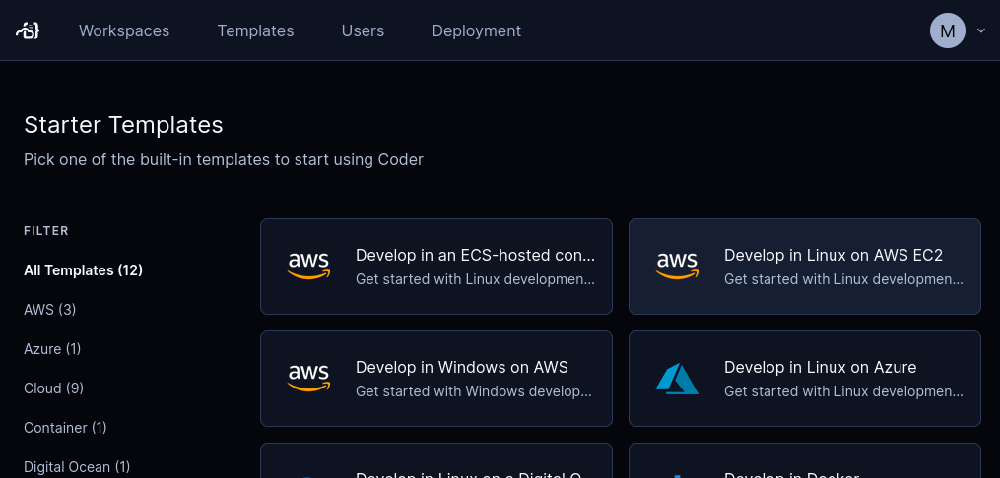
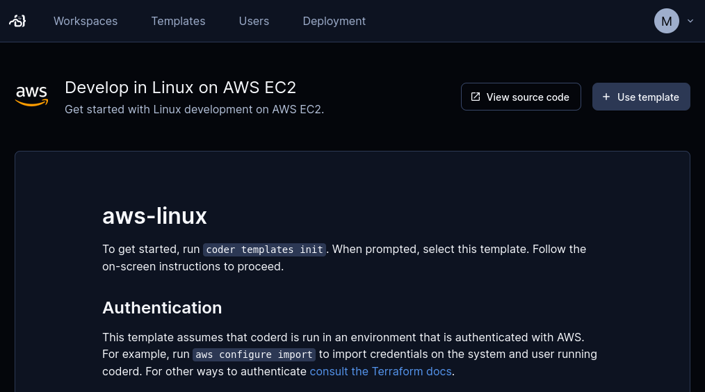

# An ARM64 in every pocket

Raspberry Pi rebooted an important segment of computing for educators and hobbyists. It makes digital technology interactive and fun to use again, and at a reasonable cost for anyone who’s curious and creative.

I’d like to start an education-related project based on ARM64 assembly language, and that’s a problem.

## My problem: Raspberry Pi is a physical device in short supply

The pandemic and the resulting supply chain problems conspired to raise demand for the already-popular Raspberry Pi while lowering supply. Things are getting better but finding a Raspberry Pi at a reasonable price isn't easy.

A smaller challenge is carrying a Raspberry Pi around. Setting it up at home is easy. But traveling with it is kind of a pain. To set it up and take it down at a cafe or a hotel room means I have to carry an extra set of cables and a power adapter.

## Solution: An anywhere ARM64 dev environment

What I’d like is an ultra-portable ARM64 device that I can use for development. By “portable” I mean that’s it’s available anywhere. The “ultra” part means that I don’t want to have to carry the physical device and its accessories with me. And I’d like the full desktop experience because my project is all about interactivity.

I chose to solve this with Coder and [AWS EC2 Graviton](https://aws.amazon.com/ec2/graviton/).

- With Coder, I can create a workspace that spins up a container for ARM64 Ubuntu letting me work on my project wherever I want.
- Graviton is the AWS ARM64-based EC2 service. I’ll run Ubuntu with a desktop environment and access it remotely with VNC.
- Bonus points for remotely accessing my ultra-portable ARM64 device with just a browser-based VNC client.

This will be an excellent solution while I wait to finally get my hands on a real Raspberry Pi.

## Reuse a wheel instead of reinventing it

A Coder workspace provides a development environment. A Coder template describes what’s in the workspace, how to spin it up, and how to take it down.

Coder comes with a growing list of example templates and there’s an expanding ecosystem of third party templates. Unfortunately I couldn’t find a template that provisions ARM64, Linux, a desktop environment, and VNC.

But I can adapt an existing template pretty easily. To set up my ARM64 desktop workspace, I’ll reuse Coder’s template for [Linux on AWS EC2](https://github.com/coder/coder/tree/main/examples/templates/aws-linux).

This template creates a workspace for an EC2 instance of Ubuntu on amd64. Because a Coder template is just a Terraform file, I can edit the template to meet my needs.

Let me show you how I got the template ready in these steps:

1. Set up AWS credentials.
2. Start with a starter template.
3. Use ARM64 instead of amd64.
4. Install a desktop environment and VNC.

As you can see, I'm doing this incrementally to make things easier. I can do this because Coder automatically versions its templates and lets me edit templates in-browser. If I make a mistake as I figure this out, I can always roll back.

## Start with a starter template

After logging into the Coder instance on my home lab, I select **Templates**, **Starter templates**, then **Develop in Linux on AWS EC2**.



A new page shows details about setting up the new template. This includes a sample AWS access policy that lets Coder authenticate its access to AWS EC2. We’ll get back to this in a minute.



To can I create and edit the template I ssh into my homelab, named marvin, where my Coder instance is running. From there I log into Coder on the command line and initialize the aws-linux template:

```bash
marc@marvin:~$ coder login https://my-coder-instance.coder.app
> Welcome to Coder, marc! You're authenticated.
marc@marvin:~$ coder templates init
...
Extracting  aws-linux  to ./aws-linux...
Create your template by running:

   cd ./aws-linux && coder templates create

Examples provide a starting point and are expected to be edited! 🎨
```

Coder created a new directory, aws-linux with files ready to edit. I’ll rename it to a character who likes pie from my favorite movie and start editing the Terraform file.

```bash
marc@marvin:~$ mv aws-linux fabienne
```

## Add AWS credentials

To start and stop my workspace, Coder needs my AWS credentials . Let’s open a new browser tab for AWs.

In AWS IAM, I’ve created a new user, fabienne, and copy-pasted the AWS access policy that we saw earlier.

With an access key and secret access key from AWS IAM, I’ll create AWS CLI configuration files for the coder user on marvin, with a profile for fabienne.

```bash
marc@marvin:~$ mv aws-linux fabienne
marc@marvin:~$ cd fabienne
marc@marvin:~$ sudo -u coder aws configure --profile fabienne
marc@marvin:~/fabienne$ vim main.tf
```


```bash
marc@marvin:~$ sudo -u coder aws configure --profile fabienne
```

Let’s get this template ready to use. When I select Use template, Coder asks me for details about the new template. I fill out the **Name**, **Display name**, **Description**, then choose an emoji icon.

I leave the rest of the fields with their defaults and select **Create template**.

## Create the template and a workspace

```bash
marc@marvin:~/fabienne$ coder templates create
```

## Start and stop the workspace

1. Start the workspace in Coder.
2. Confirm in EC2 that it's running.
3. Stop the workspace in Coder.
2. Confirm in EC2 console that it stopped.
2. Start up VNC locally and connect with Coder port-forwarding
3. Start VS Code on the ARM device, create hello.s in ARM64 assembly language.
4. Run it.
5. Stop the workspace.

## Add VNC

1. Start the workspace in Coder.
2. On the command line, install a desktop environment and VNC.
3. Configure VNC.

## Develop in ARM64

1. Connect to VNC with web client.
4. Develop!

## Conclusion: Assemble!

- Now I can assemble ARM64 code wherever I want.

### Editorial Notes

- I need some ARM64 compute. Since I’ll be using a VM instead of a container, I won’t have to worry about persistent storage for source code when the Coder workspace isn't running.
- Create a Coder template
- Edit the template Edit the tf file in the template: use ARM64.
- Since this is a VM, I already get persistence.
- For GUI desktop interactivity, I’ll customize a Raspbian Docker image to include VNC.
- For less lag in the UI as I change geographical location, I’ll reconfigure the tf parameter for the AWS instance’s geographical location

