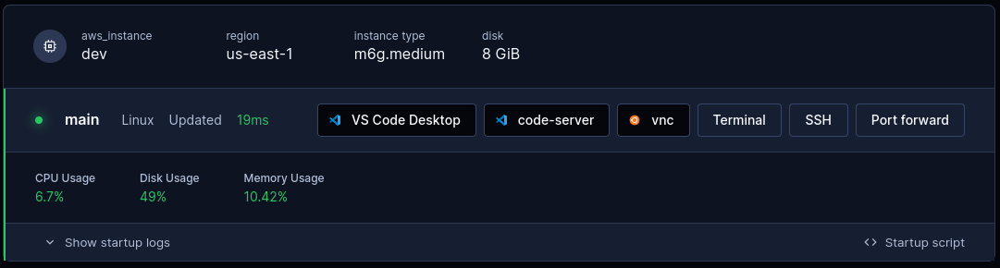

# An ARM64 in every pocket

Raspberry Pi rebooted an important segment of computing for educators and hobbyists. It makes digital technology interactive and fun to use again, and at a reasonable cost for anyone who’s curious and creative.

I’d like to start an education-related project based on ARM64 assembly language, and that’s a problem.

## My problem: Raspberry Pi is in short supply

The pandemic and the resulting supply chain problems conspired to raise demand for the already-popular Raspberry Pi while lowering supply. Things are getting better but finding a Raspberry Pi at a reasonable price isn't easy.

A smaller challenge is carrying a Raspberry Pi around. Setting it up at home is easy. But traveling with it is kind of a pain. To set it up and take it down at a cafe or a hotel room means I have to carry an extra set of cables and a power adapter.

## Solution: An anywhere ARM64 dev environment

What I’d like is an ultra-portable ARM64 device that I can use for development. By “portable” I mean that’s it’s available anywhere. The “ultra” part means that I don’t want to have to carry the physical device and its accessories with me. And I’d like the full desktop experience because my project is all about interactivity.

I chose to solve this with Coder and [AWS EC2 Graviton](https://aws.amazon.com/ec2/graviton/).

- With Coder, I can create a workspace that spins up a container for ARM64 Ubuntu letting me work on my project wherever I want.
- Graviton is the AWS ARM64-based EC2 service. I’ll run Ubuntu with a desktop environment and access it remotely with VNC.
- Bonus points for remotely accessing my ultra-portable ARM64 device with just a browser-based VNC client.

This will be an excellent solution while I wait to finally get my hands on a real Raspberry Pi.

## Reuse a wheel instead of reinventing it

A Coder workspace provides a development environment. A Coder template describes what’s in the workspace, how to spin it up, and how to take it down.

Coder comes with a growing list of example templates and there’s an expanding ecosystem of third party templates. Unfortunately I couldn’t find a template that provisions ARM64, Linux, a desktop environment, and VNC.

But I can adapt an existing template pretty easily. To set up my ARM64 desktop workspace, I’ll reuse Coder’s template for [Linux on AWS EC2](https://github.com/coder/coder/tree/main/examples/templates/aws-linux).

This template creates a workspace for an EC2 instance of Ubuntu on amd64. Because a Coder template is just a Terraform file, I can edit the template to meet my needs.

I did this in these steps:

0. Start with a starter template.
1. Set up AWS credentials.
2. Create the template.
3. Use ARM64 instead of amd64.
4. Install a desktop environment and VNC.
5. Develop on an ultra-portable ARM64!

I'm doing this incrementally to make things easier. Coder helps me along the way by letting me edit templates in-browser and automatically versioning them. If I make a mistake as I figure this out, I can always roll back.

## 0. Start with a starter template

To start, from my browser I log into my Coder instance running on my homelab, Marvin.  I select **Templates**, **Starter templates**, then **Develop in Linux on AWS EC2**.


A new page shows details about setting up the new template. This includes a sample AWS access policy that lets Coder authenticate its access to AWS EC2.


## 1. Set up AWS credentials

To start and stop my workspace, Coder needs my AWS credentials. The sample AWS access policy specifies these permissions for me.

In a new browser tab, I log in to AWS IAM to create this policy.


Then I create a new AWS user, named after a character who likes pie from my favorite movie. I associate the template's policy with this user.


With an access key and secret access key from AWS IAM, I'm ready to create the AWS CLI configuration files for the Coder user on marvin, with a profile for fabienne. I do this by logging in to Marvin:

```bash
marc@marvin:~$ cd /home/coder && sudo -u coder aws configure --profile fabienne
```

## 2. Create the template

To create and edit the template I ssh into Marvin to use Coder from the command line so I can initialize a template, choose the AWS Linux starter template, and create it:

```bash
marc@marvin:~$ coder login https://my-coder-instance.coder.app
> Welcome to Coder, marc! You're authenticated.
marc@marvin:~$ coder templates init fabienne
...
Extracting  aws-linux  to ./fabienne...
Create your template by running:

   cd ./fabienne && coder templates create

Examples provide a starting point and are expected to be edited!

marc@marvin:~$ cd ./fabienne && coder templates create

> Upload "~/fabienne"? (yes/no) yes
> Confirm create? (yes/no) yes
The fabienne template has been created at May 29 14:28:39! Developers can
provision a workspace with this template using:

   coder create --template="fabienne" [workspace name]

marc@marvin:~/fabienne$
```

I know my credentials and access policy work fine because Coder didn't report any errors.

With a valid template, I can go back to my browser to do the last steps.


## 3. Use ARM64 instead of amd64

This template specifies a vanilla AWS EC2 instance running Ubuntu on amd64.

To convert it to run an ARM64 instance of AWS EC2, I can edit the template's Terraform file in my browser. In my browser, I can see that the Fabienne template is ready to use.


I select **fabienne** then choose **Edit files** from the dropdown menu.


The edits I make to this file:

* Replace `amd64` with `arm64`.
* Replace the EC2 instance types with, in my case, `m6g`, which is the type for AWS Graviton that I'll use.
* In `data "coder_parameter" "instance_type"`, I shorten the list of options because there are fewer choices for ARM64 instances.
* In `provider "aws"`, I point to the AWS configuration files in Marvin's `/home/coder` directory that I created earlier.

To save my changes and see if I broke anything, I select **Build template**. I can keep an eye on the progress in **Build log**.


With a successful switch to ARM64, I make this version of the template available to workspaces. Selecting **Publish version** prompts me to give this version a name. If something goes wrong, I can always keep using a working template version.


## 4. Install a desktop environment and VNC

All right, this is the home stretch. With a valid template for ARM64, I can add a desktop environment and VNC.

I do this by editing the template's Terraform file again, so I can stay in the same browser tab.

I make these edits to `startup_script` in `resource "coder_agent" "main"`:

* Install [LXDE](https://www.lxde.org/), which Pixel in Raspberry Pi OS is based on.
* Install [KasmVNC](https://www.kasmweb.com/kasmvnc), which includes a web-based client.
* Add a bit of logic to detect if these packages are already installed.
* Configure certificates, authentication, and forwarding VNC traffic to port 8444.

And to make it easier to connect to VNC from the workspace, I add a new [`coder_app`](https://coder.com/docs/v2/latest/ides/web-ides) resource to provide a custom button in the workspace page to connect to the VNC client.

Then I re-build the template and publish a new version, like I did in the previous step.

## 5. Develop on an ultra-portable ARM64!

Now I'm ready to create a workspace with my new ARM64, VNC-enabled template: I select **Use template**.


Then I enter a name for my new workspace and select **Create workspace** at the bottom of the page.


This is the first time I create this workspace, so it'll take a minute or two for Coder to provision the ARM64 instance, install LXDE, KasmVNC, and all their dependencies. After that, starting and stopping the workspace will be pretty quick.

My new workspace is running and VNC should be ready to connect to.




1. Connect to VNC with web client.
4. Develop!

## Conclusion: Assemble!

- Now I can assemble ARM64 code wherever I want.

- For less lag in the UI as I change geographical location, I’ll reconfigure the tf parameter for the AWS instance’s geographical location

